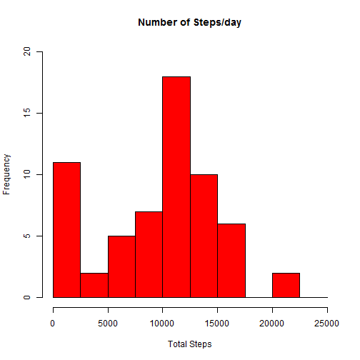
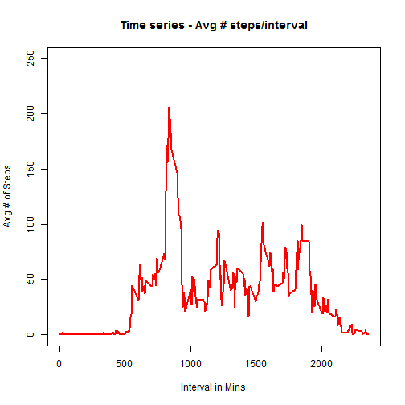
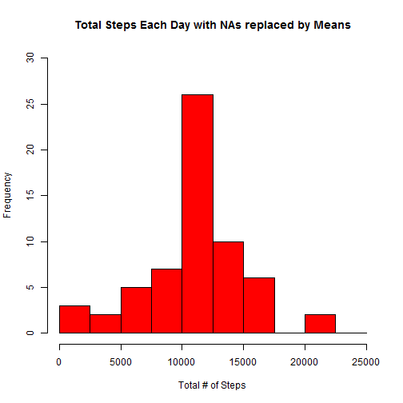
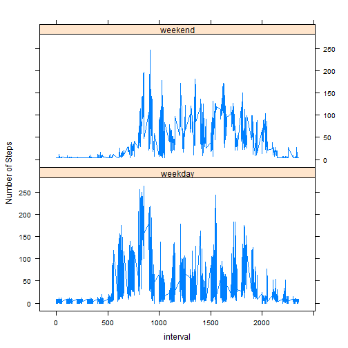

---
#Reproducible Research Project 1

##Tod Yates

##July 8, 2016


###Instructions
It is now possible to collect a large amount of data about personal movement using activity monitoring devices such as a Fitbit, Nike Fuelband, or Jawbone Up. These type of devices are part of the "quantified self" movement - a group of enthusiasts who take measurements about themselves regularly to improve their health, to find patterns in their behavior, or because they are tech geeks. But these data remain under-utilized both because the raw data are hard to obtain and there is a lack of statistical methods and software for processing and interpreting the data.

This assignment makes use of data from a personal activity monitoring device. This device collects data at 5 minute intervals through out the day. The data consists of two months of data from an anonymous individual collected during the months of October and November, 2012 and include the number of steps taken in 5 minute intervals each day.

###Data

The data for this assignment can be downloaded from the course web site:

- Dataset: [Activity monitoring data](https://d396qusza40orc.cloudfront.net/repdata%2Fdata%2Factivity.zip)  [52K] 
(Note: the dataset also comes down from Github when you fork the repo, so download here isn't mandatory.)

The variables included in this dataset are:

- **steps:** Number of steps taking in a 5-minute interval (missing values are coded as NA)

- **date:** The date on which the measurement was taken in YYYY-MM-DD format

- **interval:** Identifier for the 5-minute interval in which measurement was taken


The dataset is stored in a comma-separated-value (CSV) file and there are a total of 17,568 observations in this dataset.

###Review criteria

**Repo**

1. Valid GitHub URL

2. At least one commit beyond the original fork

2. Valid SHA-1

3. SHA-1 corresponds to a specific commit


**Commit containing full submission**

1. Code for reading in the dataset and/or processing the data

2. Histogram of the total number of steps taken each day

3. Mean and median number of steps taken each day

4. Time series plot of the average number of steps taken

5. The 5-minute interval that, on average, contains the maximum number of steps

6. Code to describe and show a strategy for imputing missing data

7. Histogram of the total number of steps taken each day after missing values are imputed

8. Panel plot comparing the average number of steps taken per 5-minute interval across weekdays and weekends

9. All of the R code needed to reproduce the results (numbers, plots, etc.) in the report


###Assignment

This assignment will be described in multiple parts. You will need to write a report that answers the questions detailed below. Ultimately, you will need to complete the entire assignment in a **single R markdown document** that can be processed by **knitr** and be transformed into an HTML file.

Throughout your report make sure you always include the code that you used to generate the output you present. When writing code chunks in the R markdown document, always use <span style="color:red">echo = TRUE</span> so that someone else will be able to read the code. **This assignment will be evaluated via peer assessment so it is essential that your peer evaluators be able to review the code for your analysis.**

For the plotting aspects of this assignment, feel free to use any plotting system in R (i.e., base, lattice, ggplot2)

Fork/clone the [GitHub repository created for this assignment](http://github.com/rdpeng/RepData_PeerAssessment1). You will submit this assignment by pushing your completed files into your forked repository on GitHub. The assignment submission will consist of the URL to your GitHub repository and the SHA-1 commit ID for your repository state.

NOTE: The GitHub repository also contains the dataset for the assignment so you do not have to download the data separately.

**Loading and preprocessing the data**

Show any code that is needed to

1. Load the data (i.e. <span style="color:red">read.csv()</span>)

2. Process/transform the data (if necessary) into a format suitable for your analysis


**What is the mean total number of steps taken per day?**


For this part of the assignment, you can ignore the missing values in the dataset.


1. Calculate the total number of steps taken per day

2. If you do not understand the difference between a histogram and a barplot, research the difference between them. Make a histogram of the total number of steps taken each day

3. Calculate and report the mean and median of the total number of steps taken per day


**What is the average daily activity pattern?**

1. Make a time series plot (i.e. <span style="color:red">type = "l"</span>) of the 5-minute interval (x-axis) and the average number of steps taken, averaged across all days (y-axis)

2. Which 5-minute interval, on average across all the days in the dataset, contains the maximum number of steps?


**Imputing missing values**

Note that there are a number of days/intervals where there are missing values (coded as <span style="color:red">NA</span>). The presence of missing days may introduce bias into some calculations or summaries of the data.

1. Calculate and report the total number of missing values in the dataset (i.e. the total number of rows with <span style="color:red">NA</span>s)

2. Devise a strategy for filling in all of the missing values in the dataset. The strategy does not need to be sophisticated. For example, you could use the mean/median for that day, or the mean for that 5-minute interval, etc.

3. Create a new dataset that is equal to the original dataset but with the missing data filled in.

4. Make a histogram of the total number of steps taken each day and Calculate and report the **mean** and **median** total number of steps taken per day. Do these values differ from the estimates from the first part of the assignment? What is the impact of imputing missing data on the estimates of the total daily number of steps?


**Are there differences in activity patterns between weekdays and weekends?**

For this part the <span style="color:red">weekdays()</span> function may be of some help here. Use the dataset with the filled-in missing values for this part.

1. Create a new factor variable in the dataset with two levels - "weekday" and "weekend" indicating whether a given date is a weekday or weekend day.

2. Make a panel plot containing a time series plot (i.e. <span style="color:red">type = "l"</span>) of the 5-minute interval (x-axis) and the average number of steps taken, averaged across all weekday days or weekend days (y-axis). See the README file in the GitHub repository to see an example of what this plot should look like using simulated data.


**Submitting the Assignment**

To submit the assignment:

1. Commit your completed <span style="color:red">PA1_template.Rmd</span> file to the <span style="color:red">master</span> branch of your git repository (you should already be on the <span style="color:red">master</span> branch unless you created new ones)

2. Commit your PA1_template.md and PA1_template.html files produced by processing your R markdown file with knit2html() function in R (from the knitr package) by running the function from the console.

2. If your document has figures included (it should) then they should have been placed in the figure/ directory by default (unless you overrided the default). Add and commit the figure/ directory to your git repository so that the figures appear in the markdown file when it displays on github.

3. Push your <span style="color:red">master</span> branch to GitHub.

4. Submit the URL to your GitHub repository for this assignment on the course web site.
In addition to submitting the URL for your GitHub repository, you will need to submit the 40 character SHA-1 hash (as string of numbers from 0-9 and letters from a-f) that identifies the repository commit that contains the version of the files you want to submit. You can do this in GitHub by doing the following

1. Going to your GitHub repository web page for this assignment

2. Click on the "?? commits" link where ?? is the number of commits you have in the repository. For example, if you made a total of 10 commits to this repository, the link should say "10 commits".

3. You will see a list of commits that you have made to this repository. The most recent commit is at the very top. If this represents the version of the files you want to submit, then just click the "copy to clipboard" button on the right hand side that should appear when you hover over the SHA-1 hash. Paste this SHA-1 hash into the course web site when you submit your assignment. If you don't want to use the most recent commit, then go down and find the commit you want and copy the SHA-1 hash.

A valid submission will look something like (this is just an **example**!)

```
1        https://github.com/rdpeng/RepData_PeerAssessment17c376cc54
2
3       47f11537f8740af8e07d6facc3d9645
```


###Loading and preparing the data

Set global options


Assumption: user has set the R working directory using setwd()

1. Load the data file

```r
        setwd("c:/users/owner/documents/coursera/course5/wk2/repdata_peerAssessment1/activity/")

#Load the data file
        activity_raw <- read.csv("activity.csv", stringsAsFactors = FALSE) 
        head (activity_raw)
```

```
##   steps       date interval
## 1    NA 2012-10-01        0
## 2    NA 2012-10-01        5
## 3    NA 2012-10-01       10
## 4    NA 2012-10-01       15
## 5    NA 2012-10-01       20
## 6    NA 2012-10-01       25
```
2. Tidy up the data for analysis

```r
# Make the date fields actual R dates
activity_raw$date <- as.POSIXct(activity_raw$date, format="%Y-%m-%d")

# Figure the dates into weekdays
activity_raw <- data.frame(date=activity_raw$date, weekday=tolower(weekdays(activity_raw$date)), steps=activity_raw$steps, interval=activity_raw$interval)

# Figure if date is a weekend or weekday
activity_raw <- cbind(activity_raw, daytype=ifelse(activity_raw$weekday == "saturday" |
        activity_raw$weekday == "sunday", "weekend", "weekday"))
        
# Create final data.frame
activity <- data.frame(date=activity_raw$date, weekday=activity_raw$weekday,
        daytype=activity_raw$daytype, interval=activity_raw$interval,
        steps=activity_raw$steps)

# Check the dataframe 
head(activity)
```

```
##         date weekday daytype interval steps
## 1 2012-10-01  monday weekday        0    NA
## 2 2012-10-01  monday weekday        5    NA
## 3 2012-10-01  monday weekday       10    NA
## 4 2012-10-01  monday weekday       15    NA
## 5 2012-10-01  monday weekday       20    NA
## 6 2012-10-01  monday weekday       25    NA
```

###Analysis Steps

**Calculate total steps, then mean and median**

1. Calculate the total number of steps taken per day. (remove missing values)


```r
# Add up total number of steps by day
sum_data <- aggregate(activity$steps, by=list(activity$date), FUN=sum, na.rm=TRUE)
 
#Rename the variables
names(sum_data) <- c("date", "total")

#Check the data frame
head(sum_data)
```

```
##         date total
## 1 2012-10-01     0
## 2 2012-10-02   126
## 3 2012-10-03 11352
## 4 2012-10-04 12116
## 5 2012-10-05 13294
## 6 2012-10-06 15420
```
2. Plot the sum data of steps in a histogram

```r
hist(sum_data$total, breaks=seq(from=0, to=25000, by=2500),
        col="red", xlab="Total Steps", ylim=c(0,20), main="Number of Steps/day")
```



3. Calculate and report the mean and median of the total number of steps taken per day

```r
mean(sum_data$total)
```

```
## [1] 9354.23
```

```r
median(sum_data$total)
```

```
## [1] 10395
```

**What is the average daily activity pattern?**

1. Make a time series plot (i.e. type = "l") of the 5-minute interval (x-axis) and the average number of steps taken, averaged across all days (y-axis)


```r
# Figure the means or steps by day by interval

mean_data <- aggregate(activity$steps, by=list(activity$interval),
        FUN= mean, na.rm=TRUE)
        
# Rename variables
names(mean_data) <- c("interval", "mean")

#Check the data
head(mean_data)
```

```
##   interval      mean
## 1        0 1.7169811
## 2        5 0.3396226
## 3       10 0.1320755
## 4       15 0.1509434
## 5       20 0.0754717
## 6       25 2.0943396
```

```r
# Plot the time series

plot(mean_data$interval,mean_data$mean, type="l", col="red", lwd=2,
        ylim = c(0,250), xlab="Interval in Mins", ylab="Avg # of Steps", main="Time series - Avg # steps/interval")
```



2. Which 5-minute interval, on average across all the days in the dataset, contains the maximum number of steps?


```r
# Calculate position of the max mean
max_pos <- which(mean_data$mean == max(mean_data$mean))

# Find the value of the interval at that position
max_interval <- mean_data[max_pos, 1]
```

The interval that contains the max number of steps on avg across all days is **835**.

**Imputing the missing values**

Note that there are a number of days/intervals where there are missing values (coded as **<span style="color:red">NA</span>**). The presence of missing days may introduce bias into some calculations or summaries of the data.

1. Calculate and report the total number of missing values in the dataset (i.e. the total number of rows with **<span style="color:red">NA</span>**)s)

```r
# Count NAs using 1s and 0s as the boolean values
NA_count <- sum(is.na(activity$steps))
```
The number of NA values is **2304**.


2. Devise a strategy for filling in all of the missing values in the dataset. The strategy does not need to be sophisticated. For example, you could use the mean/median for that day, or the mean for that 5-minute interval, etc.


```r
# Find the positions of the existing NAs
na_pos <- which(is.na(activity$steps))

# Create a vector of means
mean_vec <- rep(mean(activity$steps, na.rm=TRUE), times=length(na_pos))
```

3. Create a new dataset that is equal to the original dataset but with the missing data filled in.

```r
# Replace the NAs with the means for those positions
activity[na_pos, "steps"] <- mean_vec

# Check the data
head(activity)
```

```
##         date weekday daytype interval   steps
## 1 2012-10-01  monday weekday        0 37.3826
## 2 2012-10-01  monday weekday        5 37.3826
## 3 2012-10-01  monday weekday       10 37.3826
## 4 2012-10-01  monday weekday       15 37.3826
## 5 2012-10-01  monday weekday       20 37.3826
## 6 2012-10-01  monday weekday       25 37.3826
```


4. Make a histogram of the total number of steps taken each day and Calculate and report the **mean** and **median** total number of steps taken per day. Do these values differ from the estimates from the first part of the assignment? What is the impact of imputing missing data on the estimates of the total daily number of steps?


```r
# Figure the total amount of steps each day with NA values replaced
sum_data <- aggregate(activity$steps, by=list(activity$date), FUN=sum)

# Rename the variables
names(sum_data) <- c("date", "total")

# Plot the histogram of number of steps daily
hist(sum_data$total, breaks=seq(from=0, to=25000, by=2500),
        col="red",
        xlab="Total # of Steps",
        ylim=c(0,30),
        main="Total Steps Each Day with NAs replaced by Means")
```




The **mean** of the new data set is 10,766.19.

The **median** of the new data set is 10,766.19.

**Are there differences in activity patterns between weekdays and weekends?**

For this part the **<span style="color:red">weekdays()</span>** function may be of some help here. Use the dataset with the filled-in missing values for this part.

1. Create a new factor variable in the dataset with two levels - "weekday" and "weekend" indicating whether a given date is a weekday or weekend day.

```r
# The variable "daytype" was created in an earlier step (LoadDataStep)
head(activity)
```

```
##         date weekday daytype interval   steps
## 1 2012-10-01  monday weekday        0 37.3826
## 2 2012-10-01  monday weekday        5 37.3826
## 3 2012-10-01  monday weekday       10 37.3826
## 4 2012-10-01  monday weekday       15 37.3826
## 5 2012-10-01  monday weekday       20 37.3826
## 6 2012-10-01  monday weekday       25 37.3826
```

2. Make a panel plot containing a time series plot (i.e. <span style="color:red">type = "l"</span>) of the 5-minute interval (x-axis) and the average number of steps taken, averaged across all weekday days or weekend days (y-axis). See the README file in the GitHub repository to see an example of what this plot should look like using simulated data.


```r
# Load the lattice library
library(lattice)

# Figure the avg # of steps across both daytype variables
mean_data <- aggregate(activity$steps, by=list(activity$daytype,
        activity$weekday, activity$interval), mean)
        
# Rename the variables
names(mean_data) <- c("daytype", "weekday", "interval", "mean")

# Check the data
head (mean_data)
```

```
##   daytype  weekday interval     mean
## 1 weekday   friday        0 8.307244
## 2 weekday   monday        0 9.418355
## 3 weekend saturday        0 4.672825
## 4 weekend   sunday        0 4.672825
## 5 weekday thursday        0 9.375844
## 6 weekday  tuesday        0 0.000000
```

**Plotting the time series**


```r
xyplot(mean ~ interval | daytype, mean_data, type = "l", lwd=1, 
        xlab="interval", ylab="Number of Steps", layout=c(1,2))
```


